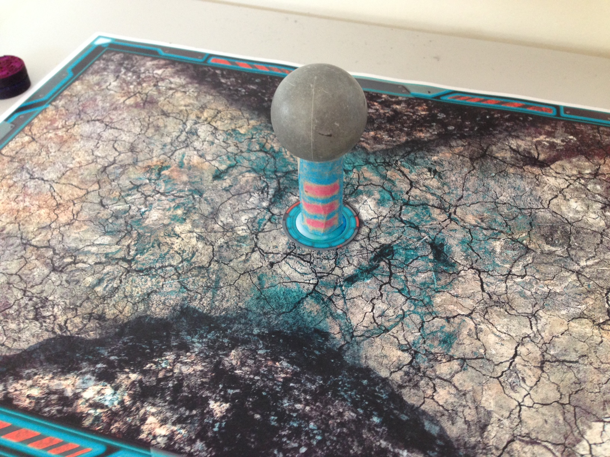
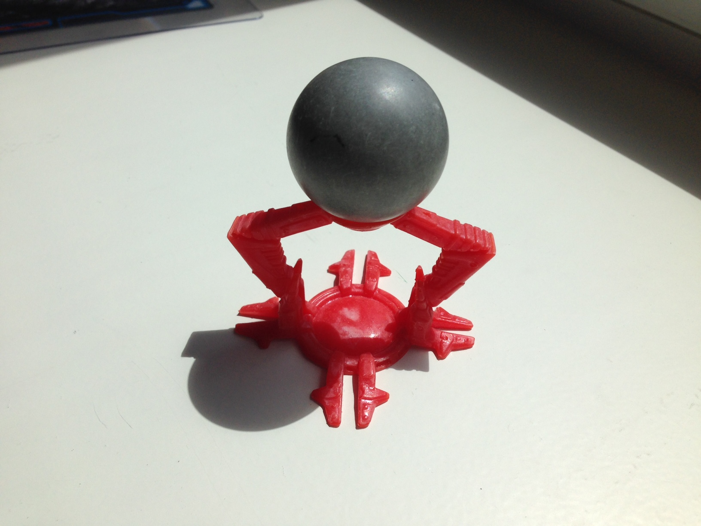
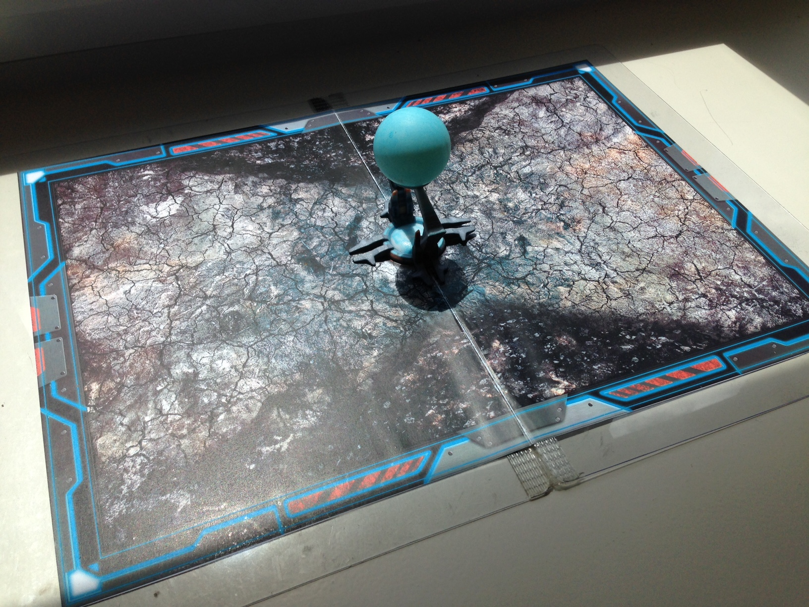

# AugmentedResistance

## Resources and instructions for Augmented Resistance game

### Image markers

You need to download and print one of the following image markers to play the game. You can use A3 format for better results.

[Download image marker (low res)](https://github.com/fi-content2-games-platform/FIcontent.Gaming.Content.AugmentedResistance/releases/download/1.0/marker_low.jpg)

[Download image marker (high res)](https://github.com/fi-content2-games-platform/FIcontent.Gaming.Content.AugmentedResistance/releases/download/1.0/marker_hi.jpg)

Once you have printed the image marker, start the game and point your device towards the marker!

### Static vs dynamic lighting

This game supports dynamic lighting by using a light probe. To enable dynamic lighting you can access the game settings from the main menu. You will also need something to act as a light probe: a ping pong ball will do the job perfectly!

### Crafting the base

You can easily craft your own probe stand and place it in the center of the board. The cylinder height should be 5cm.
Here's an example:

[images/ghetto_base.JPG|width=200px)

### 3d Printable Base

In alternative you can 3d print our base model to place your light probe. Here's how it looks like:

You can download the package linked below that contains the files to 3d print your base. Note that the base must be 5cm high on a A3 marker. The game contains a secret debug GUI accessible from the bottom left corner of the game screen that allows you to adjust the light probe position to match your base in case you need it.
Enjoy dynamic lighting in AR!

[Download 3d printable base](https://github.com/fi-content2-games-platform/FIcontent.Gaming.Content.AugmentedResistance/releases/download/1.0/base.rar)

